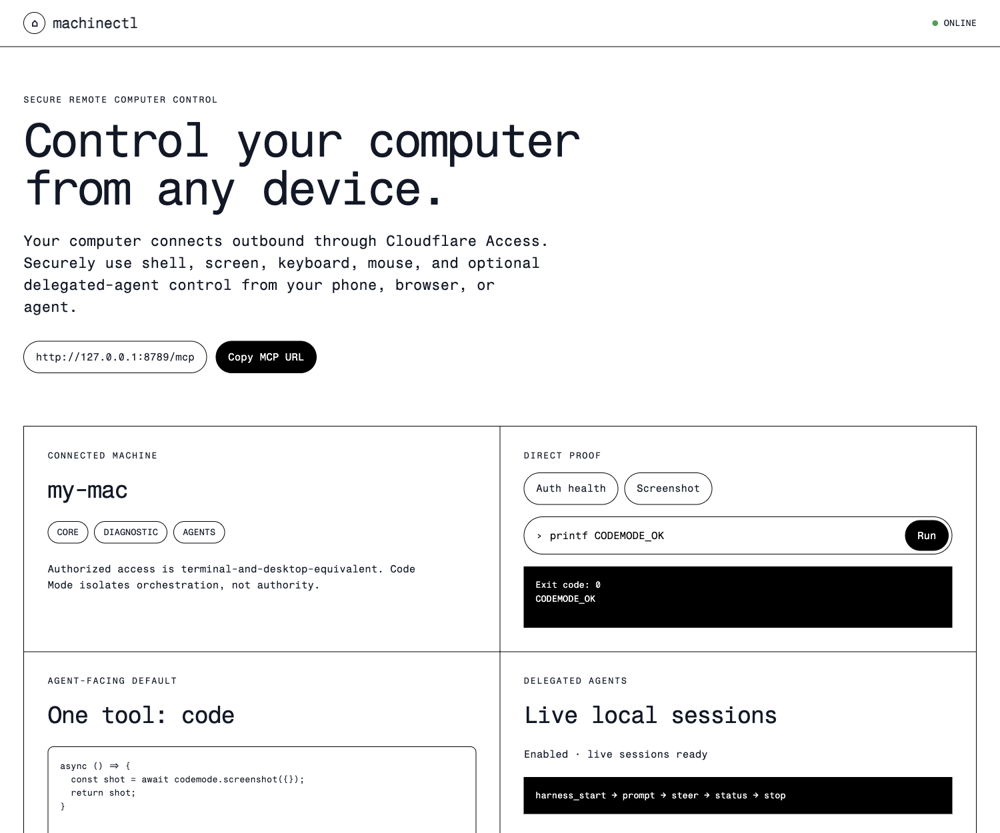

# machinectl

**Control your computer from any device, securely.**



The repository includes this thin Code Mode control client for local proof or private deployment behind an Access policy you control. There is no shared hosted demo.

`machinectl` turns a laptop into an authenticated MCP-controlled machine over an outbound WebSocket connection. From a phone or another agent client, you can run shell commands, view and control the desktop, and optionally drive local delegated-agent harness sessions. [`pi`](https://github.com/badlogic/pi-mono) is the first adapter.

```text
phone / MCP client
        │ authenticated through your relay
        ▼
Cloudflare Access + Worker relay
        │ outbound WebSocket opened by your laptop
        ▼
machinectl daemon on your computer
        ├── shell / screenshot / mouse / keyboard
        ├── local_auth_status
        └── optional delegated-agent harness sessions
```

No inbound listener on your laptop. No public tunnel to your desktop. When the daemon disconnects, its tools disappear from the relay.

> **Security:** this is intentionally powerful. Anyone allowed to invoke your connected relay can execute commands as your local user and operate your visible desktop. Only run it behind authentication you control and trust.

## What you can do

| Capability | Tool | Examples |
|---|---|---|
| Terminal access | `shell` | Files, git, builds, scripts, installed CLIs, clipboard/notifications via platform commands |
| See the computer | `screenshot` | Capture the current desktop as a PNG |
| Control the computer | `mouse`, `keyboard` | Move/click/scroll, type text, issue shortcuts |
| Diagnose local auth | `local_auth_status` | Secret-free, bounded health summary from `cf-local` |
| Drive delegated agents | `harness_*` (opt-in) | Discover adapters; start, prompt, steer, inspect, abort and stop sessions. Pi is the first adapter. |

### Example: ordinary computer control

```text
shell({ command: "git status --short", cwd: "/Users/me/projects/app" })
screenshot({})
mouse({ action: "click", x: 420, y: 300 })
keyboard({ action: "type", text: "npm test" })
keyboard({ action: "key", key: "return" })
```

### Example: delegated-agent harness control

```text
harness_catalog({})
harness_start({ harnessId: "pi", cwd: "/Users/me/projects/app" })
harness_prompt({ harnessId: "pi", id: "<session-id>", message: "Inspect the failing tests and fix them." })
harness_steer({ harnessId: "pi", id: "<session-id>", message: "Do not modify migrations." })
harness_control({ harnessId: "pi", id: "<session-id>", command: "get_last_assistant_text" })
harness_stop({ harnessId: "pi", id: "<session-id>" })
```

## Why this is different

`machinectl` is not a cloud sandbox, a Screen Sharing server, or a desktop assistant app. It is an authenticated outbound control channel to a **real user-owned computer**:

- unlike sandbox computer-use systems, it reaches the apps, files and sessions already on your laptop;
- unlike remote desktop/VNC, it does not require exposing an inbound desktop service;
- unlike local automation CLIs, it makes those capabilities reachable from another authenticated device or agent;
- unlike a desktop companion, it stays deliberately small: transport, machine capabilities and delegated-agent adapters.

## Built with Cloudflare

The reference architecture demonstrates a Cloudflare-native device-connector pattern:

| Primitive | Role |
|---|---|
| Cloudflare Access | Authenticates the human or agent allowed to reach a high-authority private device. |
| Workers | Hosts the MCP relay endpoint and policy boundary. |
| Durable Objects | Routes one live outbound-connected laptop per authenticated identity. |
| WebSocket Hibernation | Keeps the long-lived device channel economical. |
| KV, optional | Stores content-minimizing audit receipts without command output content. |
| Code Mode / Dynamic Workers | An adopting client can orchestrate the compact machine tool surface through isolated generated code. |

The deployed dogfood client uses Code Mode as its preferred model-facing interface. This repository also ships a thin Code Mode control client example for local proof or private deployment; the raw relay example remains available when you want the smallest inspectable MCP bridge.

## Architecture

`machinectl` is the **laptop daemon**. A remote caller needs a compatible authenticated relay. This repository includes a deployable Cloudflare Worker relay reference in [`examples/cloudflare-worker-relay`](./examples/cloudflare-worker-relay/).

```text
┌──────────────────────────────┐
│ Authenticated MCP client      │
└──────────────┬───────────────┘
               │ POST /machinectl/mcp
┌──────────────▼───────────────┐
│ Cloudflare Worker relay       │
│ Access auth + MachineHost DO  │
│ optional minimal receipts     │
└──────────────┬───────────────┘
               │ persistent outbound WebSocket
┌──────────────▼───────────────┐
│ Your laptop                  │
│ machinectl daemon             │
└──────────────────────────────┘
```

The relay is deliberately separate from the daemon: you can use the included Cloudflare implementation or provide another compatible authenticated endpoint implementing the wire protocol in [`src/protocol.ts`](./src/protocol.ts).

Two client/relay examples are included:

| Example | Use it for |
|---|---|
| [`examples/cloudflare-worker-relay`](./examples/cloudflare-worker-relay/) | Smallest raw MCP relay behind Cloudflare Access. |
| [`examples/codemode-control`](./examples/codemode-control/) | Thin private control page plus Code Mode-first MCP endpoint backed by Dynamic Workers. |

## Quick start

### Requirements

- Node.js 20+
- macOS for the full screen/mouse/keyboard experience
  - shell and screenshot have limited Linux support
- A trusted compatible Worker relay
  - the included Cloudflare Worker example requires a Cloudflare account, hostname and Access application
- `cloudflared` on the laptop when authenticating to a Cloudflare Access-protected relay
- Optional: `pi` on `PATH` for live structured Pi RPC control

### 1. Install the daemon

```bash
git clone https://github.com/acoyfellow/machinectl
cd machinectl
npm install
npm run build
```

### 2. Deploy a private relay

The included reference relay is under [`examples/cloudflare-worker-relay`](./examples/cloudflare-worker-relay/):

```bash
cd examples/cloudflare-worker-relay
npm install
cp wrangler.jsonc.example wrangler.jsonc
```

Edit `wrangler.jsonc` with:

- a hostname you control, for example `machinectl.example.com`;
- your Cloudflare Access application audience tag;
- your Access team issuer;
- optionally, a KV namespace for content-minimizing audit receipts.

Deploy it:

```bash
npm run typecheck
npm run deploy
```

Protect the hostname with a Cloudflare Access self-hosted application before connecting a laptop. Verify the MCP path is not publicly callable:

```bash
curl -I https://machinectl.example.com/machinectl/mcp
```

You should be required to authenticate through Access.

### 3. Connect your laptop

From the repository root:

```bash
export MACHINECTL_URL=https://machinectl.example.com
cloudflared access login "$MACHINECTL_URL"

npm start
```

Expected output:

```text
[machinectl] connecting to wss://machinectl.example.com/machinectl/connect as "your-machine"
[machinectl] connected; publishing tool catalog
```

For explicit working directories and optional delegated-agent adapters:

```bash
MACHINECTL_URL=https://machinectl.example.com \
MACHINECTL_ALLOWED_PATHS="$HOME/projects" \
MACHINECTL_ENABLE_PI=1 \
  npm start
```

### 4. Connect an MCP client

Point an Access-capable MCP client at:

```text
https://machinectl.example.com/machinectl/mcp
```

Start safely:

```text
screenshot({})
shell({ command: "pwd" })
```

## Tools

### Core computer-control tools

#### `shell`

```ts
shell({
  command: "npm test",
  cwd: "/Users/me/projects/app", // optional; requires MACHINECTL_ALLOWED_PATHS
  timeoutMs: 60000                // optional
})
```

Runs through `bash -lc` as the daemon user. Output is capped. On timeout or daemon shutdown, machinectl terminates the shell process group.

`MACHINECTL_ALLOWED_PATHS` limits only an explicit `cwd`; it does **not** sandbox shell command contents.

#### `screenshot`

```ts
screenshot({})
```

Returns a PNG data URL and deletes its temporary local capture after reading it. Screen contents may be sensitive.

#### `mouse`

```ts
mouse({ action: "move", x: 400, y: 300 })
mouse({ action: "click", x: 400, y: 300 })
mouse({ action: "double_click", x: 400, y: 300 })
mouse({ action: "scroll", delta: -4 })
```

Implemented on macOS using System Events and requires user-approved Accessibility permission.

#### `keyboard`

```ts
keyboard({ action: "type", text: "hello" })
keyboard({ action: "key", key: "return" })
keyboard({ action: "key", key: "c", modifiers: ["command"] })
```

Implemented on macOS using System Events and requires user-approved Accessibility permission.

#### `local_auth_status`

```ts
local_auth_status({})
```

Returns a bounded allowlisted projection from `cf-local status --json --remote`. It is diagnostic-only and should not be used to automatically trigger relinking or interactive recovery steps.

### Optional delegated-agent harness tools

Configure allowed roots plus whichever adapters you want to expose before starting the daemon:

```bash
MACHINECTL_ALLOWED_PATHS="$HOME/projects"
MACHINECTL_ENABLE_PI=1          # live RPC steering + pi_* compatibility aliases
```

| Tool | Purpose |
|---|---|
| `harness_catalog` | List available adapters and honest capabilities. |
| `harness_start` | Start a delegated-agent session. |
| `harness_list` | List active/recent tracked sessions. |
| `harness_status` | Read normalized status and recent events. |
| `harness_logs` | Read bounded process output. |
| `harness_prompt` | Send a prompt. |
| `harness_steer` | Steer work when supported. |
| `harness_follow_up` | Queue subsequent work when supported. |
| `harness_control` | Issue an allowlisted adapter-specific command. |
| `harness_abort` | Abort current work. |
| `harness_stop` | Stop the process tree while preserving bounded logs in memory. |

Pi is the initial adapter and supports live RPC steering. The existing `pi_*` tools remain as deprecated compatibility aliases. Process handles are retained in daemon memory; a daemon restart loses active handles.

## Code Mode

`machinectl` exposes a small underlying computer capability set. Code Mode is a natural higher-level interface for clients that support it: a client can expose one isolated `code` tool that orchestrates `shell`, desktop controls and `harness_*` operations without repeated model/tool round trips.

That orchestration layer belongs in the authenticated client or relay. The daemon deliberately remains a simple, inspectable computer-control backend.

## Configuration

| Variable | Default | Description |
|---|---:|---|
| `MACHINECTL_URL` | required | URL of your trusted compatible Worker relay. |
| `MACHINECTL_NAME` | hostname | Machine name published to the relay. |
| `MACHINECTL_ACCESS_TOKEN` | unset | Explicit token override instead of retrieving an Access token through `cloudflared`. |
| `MACHINECTL_ALLOWED_PATHS` | empty | Permitted explicit `shell.cwd` roots and optional pi project/session roots. |
| `MACHINECTL_SHELL_TIMEOUT` | `60000` | Default shell timeout in milliseconds. |
| `MACHINECTL_SCREENSHOT_MAX_BYTES` | `8388608` | Maximum PNG bytes returned from a screenshot. |
| `MACHINECTL_ENABLE_PI` | unset | Set to `1` or `true` to publish the Pi adapter and deprecated `pi_*` aliases. |
| `MACHINECTL_PI_MAX_SESSIONS` | `4` | Maximum concurrently active pi RPC sessions. |
| `MACHINECTL_PI_MAX_RUNTIME_MS` | `7200000` | Maximum lifetime of a tracked pi process. |
| `MACHINECTL_PI_STOP_GRACE_MS` | `5000` | Grace period before force-killing a stopped pi process group. |

## Security model

An authenticated MCP caller is trusted with your computer:

- `shell` is terminal-equivalent access as your local user;
- `screenshot` can reveal private visible information;
- `mouse` and `keyboard` can operate signed-in desktop applications;
- `harness_*` tools can read and control local delegated-agent session content;
- `local_auth_status` exposes only bounded diagnostic metadata, not credentials.

The included relay example:

- authenticates calls through Cloudflare Access;
- maintains one connected laptop per authenticated identity;
- limits catalog, request, result and in-flight sizes;
- optionally stores content-minimizing audit receipts without tool output content.

Do not use an uncontained laptop relay for workloads requiring container isolation or read-only execution. See [SECURITY.md](./SECURITY.md).

## Development

```bash
npm install
npm run typecheck
npm test
npm run dev
```

The raw relay example is independently testable:

```bash
cd examples/cloudflare-worker-relay
npm install
npm test
```

To run the thin Code Mode control page end to end locally:

```bash
cd examples/codemode-control
npm install
npm run dev:worker
```

Then, from the repository root in another terminal:

```bash
npm run build
MACHINECTL_URL=http://127.0.0.1:8789 \
MACHINECTL_ACCESS_TOKEN=dev \
MACHINECTL_NAME=local-mac \
MACHINECTL_ALLOWED_PATHS="$HOME/projects" \
MACHINECTL_ENABLE_PI=1 \
  node dist/index.js
```

Open `http://127.0.0.1:8789/`. See the example README for its private-deployment posture and Code Mode endpoint.

## License

MIT. See [LICENSE](./LICENSE).
